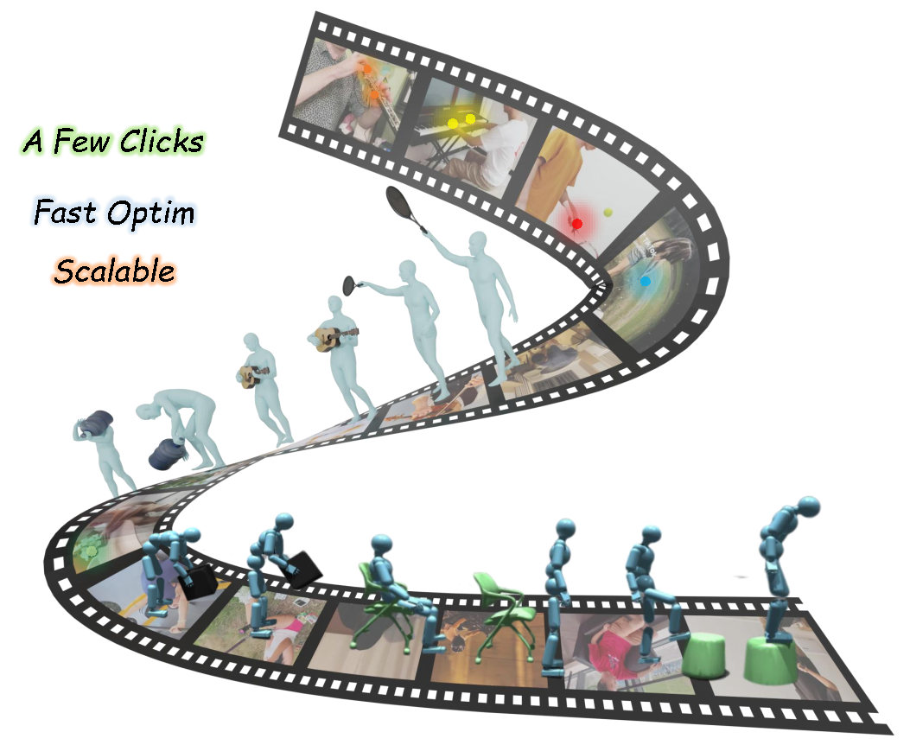

# 4DHOI Reconstruction Pipeline

<p align="center">
  
</p>

End-to-end pipeline for reconstructing 4D Human-Object Interactions from monocular video. With just **a few clicks**, preprocess a video (segmentation, motion, depth, 3D reconstruction), annotate interaction contact points, optimize poses, and render the result — **fast** and **scalable**.

## Pipeline Overview

```
                         ┌──────────────────┐
                         │   data_preparer   │  Upload video, split scenes,
                         │   (web app)       │  annotate SAM2 point prompts
                         └────────┬─────────┘
                                  │
                         ┌────────▼─────────┐
                         │  preprocessing    │  Extract frames, masks, object mesh,
                         │  (shell scripts)  │  human motion, depth, hand pose, HOI
                         └────────┬─────────┘
                                  │
              ┌───────────────────┼───────────────────┐
              │                   │                   │
     ┌────────▼─────────┐ ┌──────▼───────┐  ┌────────▼─────────┐
     │ 4dhoi_annotator   │ │  interpoint  │  │    hoi_solver     │
     │ (web app)         │ │  (model)     │  │  (optimization)   │
     │                   │ │              │  │                   │
     │ 3D annotation +   │ │ Train/eval   │  │ Least-squares +   │
     │ optional auto-    │ │ contact      │  │ Adam refinement   │
     │ prediction        │ │ prediction   │  │ + rendering       │
     └──────────────────┘ └──────────────┘  └──────────────────┘
```

## Modules

| Module | Description | Entry Point |
|--------|-------------|-------------|
| [data_preparer](data_preparer/) | Upload videos, split scenes, annotate point prompts for mask generation | `python data_preparer/app.py` |
| [preprocessing](preprocessing/) | 7-step preprocessing: frames, masks, object mesh, motion, depth, hand pose, HOI assembly | `bash preprocessing/run_pipeline.sh` |
| [interpoint](interpoint/) | Interaction point prediction model (train & evaluate) | `bash interpoint/train.sh` |
| [4dhoi_annotator](4dhoi_annotator/) | Interactive 3D annotation tool with optional auto-prediction | `python 4dhoi_annotator/app.py` |
| [hoi_solver](hoi_solver/) | Contact-based pose optimization + rendering | `bash hoi_solver/run.sh` |

## Quick Start

### 1. Download Shared Model Files

All modules share the same SMPL-X body model files. Download once to `shared_data/`:

```bash
# Required files in shared_data/:
shared_data/
├── SMPLX_NEUTRAL.npz           # SMPL-X neutral body model
├── J_regressor.pt              # Joint regressor weights
├── smplx_downsampling_1000.npz # Mesh downsampling matrix
└── part_kp.json                # 87 SMPL-X keypoint definitions
```

Each module symlinks to `shared_data/` automatically - no need to copy files to multiple locations.

**Download SMPL-X model**: Register at [smpl-x.is.tue.mpg.de](https://smpl-x.is.tue.mpg.de/) and download `SMPLX_NEUTRAL.npz`.

### 2. Setup Third-Party Dependencies (for preprocessing)

```bash
# Clone SAM2, SAM-3D-Objects, GVHMR, Depth-Anything-V2, SAM-3D-Body
bash preprocessing/setup_third_party.sh
```

Then download each model's checkpoints following their READMEs. See [preprocessing/README.md](preprocessing/) for details.

### 3. Prepare a Video

```bash
# Start the data preparation web app
python data_preparer/app.py --data_dir data --port 5020
# Open http://localhost:5020
# Upload Tab: upload video → split scenes → save segments
# Annotate Tab: click human/object points → save
```

### 4. Run Preprocessing

```bash
bash preprocessing/run_pipeline.sh data/category/session_name
```

This runs 7 steps across 3 conda environments:

| Step | Script | Env | Output |
|------|--------|-----|--------|
| 1.1 | Extract frames | sam3d_obj_4d | `frames/*.jpg` |
| 1.2 | Generate masks (SAM2) | sam3d_obj_4d | `mask_dir/`, `human_mask_dir/` |
| 1.3 | Reconstruct object (SAM-3D) | sam3d_obj_4d | `obj_org.obj` |
| 2.1 | Estimate motion (GVHMR) | 4dhoi_pipeline | `motion/result.pt` |
| 2.2 | Estimate depth | 4dhoi_pipeline | `depth.npy` |
| 3 | Refine hand pose (SAM-3D-Body) | mhr | `motion/result_hand.pt` |
| 4 | Assemble HOI | 4dhoi_pipeline | `output/obj_poses.json` |

### 5. Annotate Interactions

```bash
python 4dhoi_annotator/app.py --data_dir data --port 5027
# Open http://localhost:5027
# Visualize 3D human+object, click contact points, optimize
```

### 6. Run Optimization (Standalone)

```bash
bash hoi_solver/run.sh data/category/session_name --render
```

### 7. Train InterPoint Model (Optional)

```bash
cd interpoint
bash train.sh
bash evaluate.sh checkpoints/4dhoi/epoch_080.pth
```

## Project Structure

```
4dhoi_recon_pipeline/
├── README.md
├── shared_data/                    # Shared model files (download once)
│   ├── SMPLX_NEUTRAL.npz          # SMPL-X body model
│   ├── J_regressor.pt             # Joint regressor
│   ├── smplx_downsampling_1000.npz
│   └── part_kp.json               # 87 keypoint definitions
│
├── data_preparer/                  # Video upload + point annotation web app
│   ├── app.py
│   ├── templates/index.html
│   └── static/
│
├── preprocessing/                  # Automated preprocessing pipeline
│   ├── config.sh                   # Model paths configuration
│   ├── run_pipeline.sh             # Master script
│   ├── step1_frames_masks_obj.sh   # env: sam3d_obj_4d
│   ├── step2_motion_depth.sh       # env: 4dhoi_pipeline
│   ├── step3_hand.sh               # env: mhr
│   ├── step4_hoi.sh                # env: 4dhoi_pipeline
│   └── scripts/                    # Python processing scripts
│
├── interpoint/                     # Interaction point prediction model
│   ├── models/                     # Model architecture
│   ├── data/                       # Dataset loaders
│   ├── scripts/                    # Train + evaluate
│   ├── train.sh
│   └── evaluate.sh
│
├── 4dhoi_annotator/                # Interactive 3D annotation tool
│   ├── app.py                      # Flask application
│   ├── config.yaml                 # Annotator configuration
│   ├── ivd_predictor.py            # InterPoint model wrapper
│   ├── solver/                     # Built-in optimization
│   ├── co-tracker/                 # 2D point tracking
│   └── static/
│
└── hoi_solver/                     # Standalone pose optimization
    ├── run.sh                      # One-command optimize + render
    ├── optimize.py                 # Core solver (auto-converts annotations)
    ├── render.py                   # Global-view rendering
    ├── convert_annotations.py      # Decimated → original mesh index mapping
    └── video_optimizer/            # Optimization engine
```

## Session Data Format

Each session folder follows this structure (built up progressively by the pipeline):

```
session_folder/
├── video.mp4                       # Input video
├── select_id.json                  # Frame selection (from data_preparer)
├── points.json                     # SAM2 point prompts (from data_preparer)
├── frames/                         # Extracted frames (preprocessing step 1)
├── mask_dir/                       # Object masks (preprocessing step 1)
├── human_mask_dir/                 # Human masks (preprocessing step 1)
├── obj_org.obj                     # 3D object mesh (preprocessing step 1)
├── depth.npy                       # Depth maps (preprocessing step 2)
├── motion/
│   ├── result.pt                   # SMPL-X params (preprocessing step 2)
│   └── result_hand.pt              # With refined hands (preprocessing step 3)
├── output/
│   └── obj_poses.json              # Object scale/position (preprocessing step 4)
├── kp_record_merged.json           # Contact annotations (from 4dhoi_annotator)
├── kp_record_new.json              # Converted to original mesh (auto by hoi_solver)
└── final_optimized_parameters/     # Optimization output (from hoi_solver)
    └── all_parameters_latest.json
```

## License

[TODO: Add license]

## Citation

[TODO: Add citation]
